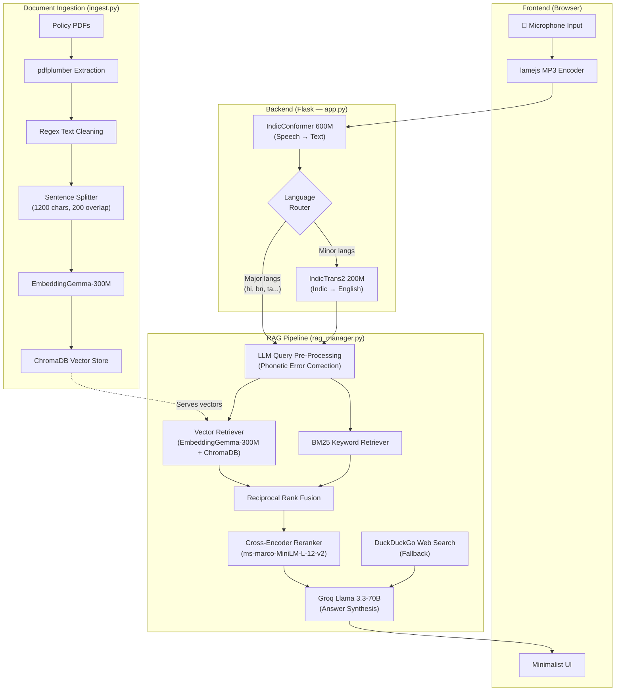

# 🌾 Kisan Mitra — Multilingual Agricultural Policy Assistant

**Kisan Mitra** ("Farmer's Friend") is an end-to-end, voice-driven, multilingual Retrieval-Augmented Generation (RAG) system that lets farmers query official government agricultural policy documents in their native Indian language and receive accurate, contextually grounded answers in real time.

A farmer speaks a question in Hindi (or 10 other Indian languages) → the system transcribes it, retrieves relevant policy passages, and responds with a precise, source-cited answer — all in under 10 seconds.

---

## Architecture



---

## Tech Stack

| Component | Technology | Role |
|-----------|-----------|------|
| **Web Framework** | Flask + Flask-CORS | REST API serving transcription, RAG, and history endpoints |
| **Frontend** | Vanilla HTML/CSS/JS | Monochrome editorial UI with in-browser MP3 recording |
| **ASR** | [IndicConformer 600M](https://huggingface.co/ai4bharat/indic-conformer-600m-multilingual) | Speech-to-text for 22 Indian languages |
| **Translation** | [IndicTrans2 200M](https://huggingface.co/ai4bharat/indictrans2-indic-en-dist-200M) | Indic → English for minor languages |
| **Embeddings** | [EmbeddingGemma 300M](https://huggingface.co/google/embeddinggemma-300m) | Document chunk embeddings (768-dim) |
| **Vector DB** | ChromaDB (local, persistent) | Stores and retrieves embedded document chunks |
| **Keyword Search** | BM25 (via llama-index) | Sparse keyword retrieval, fused with vector search |
| **Reranker** | [ms-marco-MiniLM-L-12-v2](https://huggingface.co/cross-encoder/ms-marco-MiniLM-L-12-v2) | Cross-encoder reranking of retrieved chunks |
| **LLM** | Groq Cloud — Llama 3.3 70B Versatile | Answer synthesis from retrieved context |
| **Web Search** | DuckDuckGo (via `ddgs`) | Fallback knowledge source when policy docs lack coverage |
| **Persistence** | SQLite | Conversation history across page refreshes |
| **MP3 Encoding** | lamejs (browser-side) | Real-time PCM → MP3 encoding in the browser |

---

## Project Structure

```
kisan-mitra/
├── app.py              # Flask server: ASR, translation, API endpoints
├── rag_manager.py      # RAG pipeline: retrieval, reranking, LLM synthesis
├── ingest.py           # Document ingestion: PDF → chunks → ChromaDB
├── frontend/
│   └── index.html      # Single-page UI (recording, playback, answers)
├── documents/          # Place policy PDFs here (not tracked by git)
├── data/               # Runtime data (ChromaDB vectors, SQLite history)
├── uploads/            # Temporary audio file storage
├── requirements.txt    # Python dependencies
├── setup.py            # Installable package configuration
├── .env.example        # Environment variable template
└── .gitignore
```

---

## Quick Start

### Step 1: Clone the Repository

```bash
git clone https://github.com/yourusername/kisan-mitra.git
cd kisan-mitra
```

### Step 2: Create a Virtual Environment

```bash
python -m venv venv
source venv/bin/activate   # Linux/macOS
# or: venv\Scripts\activate  # Windows
```

### Step 3: Install Dependencies

```bash
pip install -r requirements.txt
```

> **Note:** This will install PyTorch, which is ~2 GB. If you need a specific CUDA version, install PyTorch first following [pytorch.org](https://pytorch.org/get-started/locally/), then run the requirements install.

### Step 4: Set Up Environment Variables

```bash
cp .env.example .env
```

Edit `.env` and paste your Groq API key:
```
GROQ_API_KEY=gsk_your_actual_key_here
```

### Step 5: Add Policy Documents

Place your PDF policy documents into the `documents/` folder:

```bash
mkdir -p documents
# Copy your PDFs here. The system was tested with:
#   - RevisedPM-KISANOperationalGuidelines(English).pdf
#   - PMFBY.pdf
#   - PM-KMY - Operational Guidelines.pdf
#   - PDMC guidlines.pdf
```

Any `.pdf` or `.md` file in this directory will be ingested.

### Step 6: Ingest Documents into the Vector Database

```bash
python ingest.py
```

This will:
1. Extract text from all PDFs using **pdfplumber**
2. Clean the text (remove images, HTML tags, noise)
3. Split into overlapping chunks (1200 chars, 200 overlap)
4. Embed each chunk using **EmbeddingGemma-300M** (~1.2 GB download on first run)
5. Store vectors in a local **ChromaDB** database at `data/chroma_db/`

Expected output:
```
Found 4 document(s) to ingest.
Loading embedding model: google/embeddinggemma-300m
Running ingestion pipeline...
==================== INGESTION COMPLETE ====================
  Documents processed: 4
  Total nodes/chunks:  ~180
```

### Step 7: Start the Server

```bash
python app.py
```

On first run, this will automatically download three models from HuggingFace:

| Model | Size | Purpose |
|-------|------|---------|
| `ai4bharat/indic-conformer-600m-multilingual` | ~600 MB | Speech-to-text (ASR) |
| `ai4bharat/indictrans2-indic-en-dist-200M` | ~800 MB | Indic → English translation |
| `cross-encoder/ms-marco-MiniLM-L-12-v2` | ~130 MB | Retrieved chunk reranking |

> **First-run download total: ~2.7 GB.** Models are cached in `~/.cache/huggingface/` and won't be re-downloaded on subsequent runs.

Expected startup output:
```
Loading IndicConformer model... This may take a moment (it's around 600MB).
Model loaded successfully.
Loading IndicTrans2 translation model... This may take a moment.
Translation model loaded successfully.
Initializing LLM (Groq llama-3.3-70b-versatile)...
Loading Cross-Encoder for reranking (L-12)...
Agentic RAG System ready.
 * Running on http://0.0.0.0:5000
```

### Step 8: Open the Frontend

Open `frontend/index.html` in your browser (just double-click the file, or):

```bash
# On Linux:
xdg-open frontend/index.html

# On macOS:
open frontend/index.html
```

Select your language, click **Start Recording**, ask a question about any agricultural policy, and click **Stop Recording**. The system will transcribe your voice, retrieve relevant policy passages, and display the answer.

---

## API Endpoints

| Method | Endpoint | Description |
|--------|----------|-------------|
| `POST` | `/transcribe` | Upload audio (MP3), returns transcription + translation + RAG answer |
| `POST` | `/query` | Text-based RAG query (JSON body: `{"question": "..."}`) |
| `GET` | `/history` | Retrieve all past recordings and answers |
| `DELETE` | `/history` | Clear all history and audio files |
| `GET` | `/audio/<filename>` | Stream a saved audio recording |

### Example: Text Query

```bash
curl -X POST http://localhost:5000/query \
  -H "Content-Type: application/json" \
  -d '{"question": "What is the eligibility criteria for PM-KISAN?"}'
```

---

## How It Works (Pipeline Detail)

### 1. Voice Input (Frontend → Backend)
The browser captures microphone audio, encodes it to MP3 in real-time using **lamejs**, and POSTs it to `/transcribe` along with the selected language code.

### 2. Speech-to-Text (ASR)
**IndicConformer 600M** transcribes the audio in the selected Indic language. The audio is resampled to 16kHz mono before inference.

### 3. Language Routing
- **Major languages** (Hindi, Bengali, Tamil, Telugu, Marathi, Gujarati, Kannada, Malayalam, Punjabi, Urdu): Sent directly to the RAG pipeline — Groq's Llama 3.3 understands these natively.
- **Minor languages**: Translated to English first using **IndicTrans2 200M** before retrieval.

### 4. Query Pre-Processing
An LLM call corrects common ASR phonetic errors (e.g., "noodle" → "nodal", "saman" → "samman") and extracts English keywords for retrieval.

### 5. Hybrid Retrieval
Two parallel searches run over the ingested policy documents:
- **Vector search** (semantic similarity via EmbeddingGemma-300M embeddings)
- **BM25 search** (exact keyword matching)

Results are fused using **Reciprocal Rank Fusion**, then reranked by a **cross-encoder** (ms-marco-MiniLM-L-12-v2) to surface the most relevant passages.

### 6. Answer Synthesis
A single prompt containing the top policy passages + web search results is sent to **Groq's Llama 3.3-70B**. The LLM synthesizes a final answer, prioritizing official policy documents over web results.

### 7. Response
The transcription, translation (if applicable), RAG answer, and source metadata are returned to the frontend and displayed in an inverted card UI.

---

## Troubleshooting

| Issue | Solution |
|-------|----------|
| `No documents in vector store` | Run `python ingest.py` first |
| `GROQ_API_KEY not found` | Create `.env` file from `.env.example` |
| `Microphone access denied` | Allow microphone permissions in browser settings |
| `CUDA out of memory` | Close other GPU processes; ASR + translation need ~3 GB VRAM |
| Models not downloading | Check internet connection; models are cached in `~/.cache/huggingface/` |
| `ModuleNotFoundError: IndicTransToolkit` | Run `pip install git+https://github.com/VarunGumma/IndicTransToolkit.git` |


*Built by Aditya Kapoor • Internship Period: May–June 2025*
